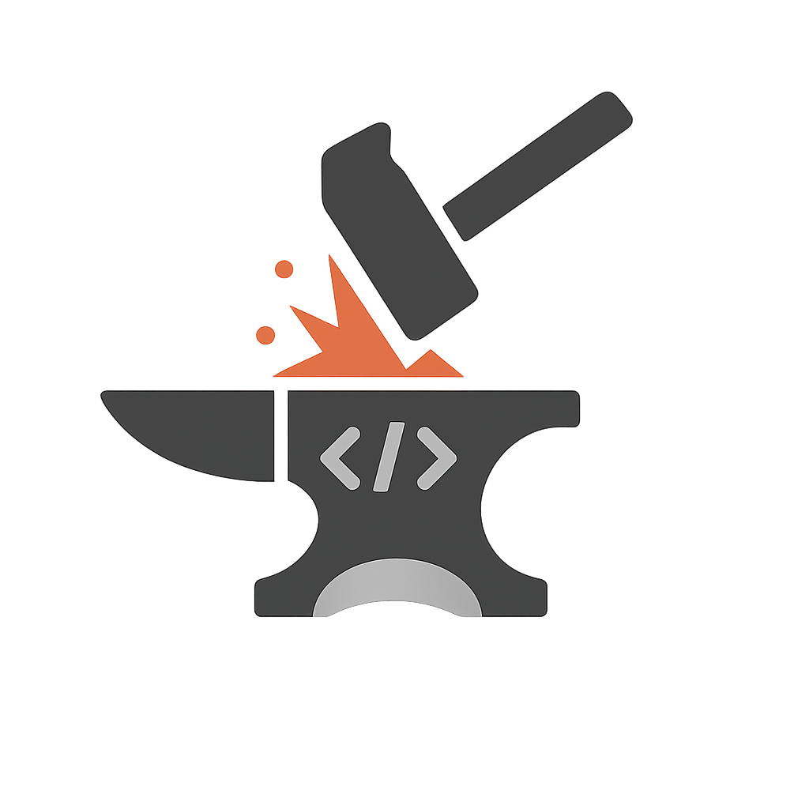

# AlphaForge – Gerador de Estruturas de Projeto para VS Code

<div align="center">



**Crie, salve e aplique templates de estrutura de projetos em segundos!**

[](https://code.visualstudio.com/)
[](https://www.typescriptlang.org/)
[](LICENSE)

</div>

---

## 📖 Sobre o Projeto

**AlphaForge** é uma extensão para Visual Studio Code que revoluciona a forma como você cria estruturas de projetos. Ao invés de criar manualmente pastas e arquivos toda vez que inicia um novo projeto, você pode:

- ✨ **Criar templates personalizados** através de uma interface visual intuitiva
- 💾 **Salvar templates reutilizáveis** para diferentes tipos de projetos
- 🚀 **Gerar estruturas completas** com um único clique
- 🎯 **Padronizar projetos** entre equipes e organizações

Perfeito para desenvolvedores que trabalham com múltiplos frameworks, linguagens ou que precisam manter padrões de projeto consistentes.

---

## ✨ Principais Recursos

### 🎨 Interface Visual Intuitiva
Esqueça edição manual de JSON! Crie sua estrutura de projeto usando um formulário amigável:
- **Adicione pastas e arquivos** com botões dedicados
- **Organize hierarquicamente** com suporte a estruturas aninhadas
- **Preencha conteúdo inicial** diretamente em cada arquivo
- **Visualize em tempo real** a estrutura sendo criada

### 📦 Gerenciamento de Templates
- Salve quantos templates quiser localmente
- Visualize todos os templates salvos com nome, descrição e data de criação
- Selecione e aplique templates com facilidade
- Exclua templates que não usa mais

### ⚡ Aplicação Rápida
- Escolha a pasta de destino através do navegador de arquivos
- Aplique o template selecionado instantaneamente
- Todos os arquivos e pastas são criados automaticamente com o conteúdo especificado

---

## 🚀 Como Usar

### 1️⃣ Abrir o AlphaForge
- Clique no ícone do **AlphaForge** na barra lateral do VS Code

### 2️⃣ Criar um Novo Template

1. **Preencha as informações básicas:**
   - Nome do template (ex: "React Component", "Express API", "Python Flask App")
   - Descrição opcional (ex: "Template para componentes React com TypeScript")

2. **Construa a estrutura do projeto:**
   - Clique em **🗁 Adicionar Pasta** para criar uma pasta na raiz
   - Clique em **🗄 Adicionar Arquivo** para criar um arquivo na raiz
   - Use o botão **+** ao lado de pastas para adicionar itens dentro delas
   - Preencha os nomes e conteúdos conforme necessário

3. **Salve o template:**
   - Clique em **💾 Salvar Template**
   - Seu template aparecerá na lista de templates salvos

### 3️⃣ Aplicar um Template

1. **Selecione um template** da lista clicando no botão **✓**
2. **Escolha a pasta de destino** usando o botão **📁 Selecionar**
3. **Aplique o template** clicando em **✨ Aplicar Template Selecionado**
4. Pronto! Toda a estrutura será criada automaticamente

---

## 🎯 Casos de Uso

### Para Desenvolvedores Freelancers
- Mantenha templates para cada tipo de projeto que você entrega
- Economize tempo na configuração inicial de projetos
- Garanta que nada seja esquecido na estrutura base

### Para Equipes de Desenvolvimento
- Padronize a estrutura de projetos em toda a equipe
- Compartilhe templates através do controle de versão
- Acelere o onboarding de novos desenvolvedores

### Para Educadores e Estudantes
- Crie templates de exercícios e projetos de aula
- Distribua estruturas base para alunos
- Mantenha consistência em projetos educacionais

### Exemplos de Templates

```
📁 React Component Template
├── 📄 index.tsx (export do componente)
├── 📄 Component.tsx (lógica do componente)
├── 📄 Component.styles.ts (estilos)
├── 📄 Component.test.tsx (testes)
└── 📄 types.ts (TypeScript types)

📁 Express API Template
├── 📁 src
│   ├── 📁 controllers
│   ├── 📁 models
│   ├── 📁 routes
│   ├── 📁 middlewares
│   └── 📄 server.ts
├── 📄 package.json
├── 📄 tsconfig.json
└── 📄 .env.example

📁 Python Flask App
├── 📁 app
│   ├── 📁 routes
│   ├── 📁 models
│   ├── 📁 templates
│   └── 📄 __init__.py
├── 📁 tests
├── 📄 requirements.txt
├── 📄 config.py
└── 📄 run.py
```

---

## 🛠️ Tecnologias Utilizadas

- **TypeScript** - Desenvolvimento type-safe da extensão
- **VS Code Extension API** - Integração nativa com o VS Code
- **WebView API** - Interface de usuário customizada
- **HTML/CSS/JavaScript** - Interface visual do painel lateral
- **Node.js** - Runtime para a extensão

---

## 📦 Instalação

### Através do VS Code Marketplace (em breve)
1. Abra o VS Code
2. Vá para a aba de Extensões (`Ctrl+Shift+X` / `Cmd+Shift+X`)
3. Procure por "AlphaForge"
4. Clique em "Instalar"

### Instalação Manual (Desenvolvimento)
```bash
# Clone o repositório
git clone https://github.com/seu-usuario/alphaforge.git

# Entre na pasta
cd alphaforge

# Instale as dependências
npm install

# Compile o projeto
npm run compile

# Abra no VS Code
code .

# Pressione F5 para executar em modo de desenvolvimento
```

## 🤝 Contribuindo

Contribuições são bem-vindas! Se você tem ideias para melhorar o AlphaForge:

1. Faça um Fork do projeto
2. Crie uma branch para sua feature (`git checkout -b feature/MinhaFeature`)
3. Commit suas mudanças (`git commit -m 'Adiciona MinhaFeature'`)
4. Push para a branch (`git push origin feature/MinhaFeature`)
5. Abra um Pull Request

---

## 📄 Licença

Este projeto está sob a licença MIT. Veja o arquivo [LICENSE](LICENSE) para mais detalhes.

---

## 👨‍💻 Autor

Desenvolvido com ❤️ por João Souza!

- GitHub: [@iamjonesss](https://github.com/iamjonesss)
- LinkedIn: [Seu Perfil](https://linkedin.com/in/iamjonesss)

---

<div align="center">

**⭐ Se este projeto te ajudou, considere dar uma estrela!**

</div>
